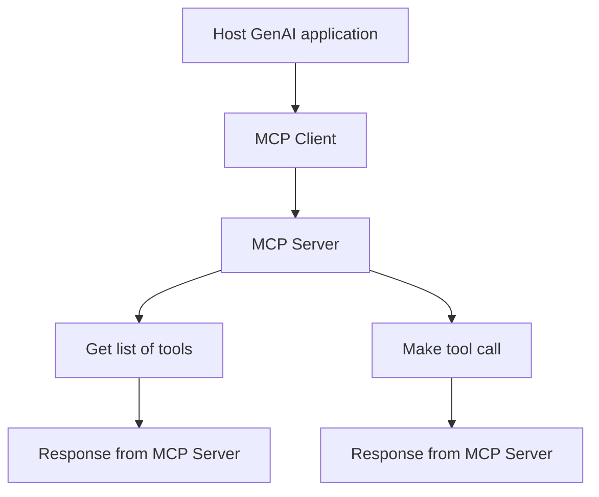

### Explanation:

- **A**: The Host GenAI application is the main component that orchestrates the interaction with the MCP Client and MCP Server.
- **B**: The MCP Client is a simple HTTP client that runs within the Host GenAI application. It is responsible for making HTTP requests to the MCP Server.
- **C**: The MCP Server is the central component that handles the communication between the Host GenAI application and the MCP Client. It is responsible for providing the list of tools and the output of the tool calls.
- **D**: The MCP Server sends a request to the Host GenAI application to get the list of tools.
- **E**: The MCP Server sends a request to the Host GenAI application to make a tool call.
- **F**: The Host GenAI application receives the response from the MCP Server and processes it.
- **G**: The Host GenAI application receives the response from the MCP Server and processes it.

This diagram illustrates the flow of data between the Host GenAI application, the MCP Client, and the MCP Server. The MCP Client makes HTTP requests to the MCP Server to get the list of tools and to make tool calls. The MCP Server responds with the list of tools and the output of the tool calls.