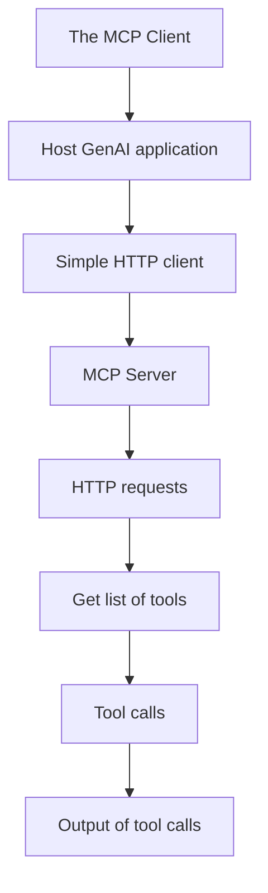

### Explanation:

- **A**: The MCP Client is a simple HTTP client that will be run by the Host GenAI application.
- **B**: The Host GenAI application is the entity that will use the MCP Client to interact with the MCP Server.
- **C**: The MCP Client is responsible for making HTTP requests to the MCP Server.
- **D**: The MCP Server is the entity that will respond to the HTTP requests made by the MCP Client.
- **E**: The MCP Server makes HTTP requests to the MCP Client.
- **F**: The MCP Server responds with the list of tools.
- **G**: The MCP Server makes tool calls.
- **H**: The MCP Server responds with the output of the tool calls.

This diagram shows the flow of data between the MCP Client, Host GenAI application, and the MCP Server. The MCP Client sends HTTP requests to the MCP Server to get the list of tools and to make tool calls. The MCP Server responds with the list of tools and the output of the tool calls.